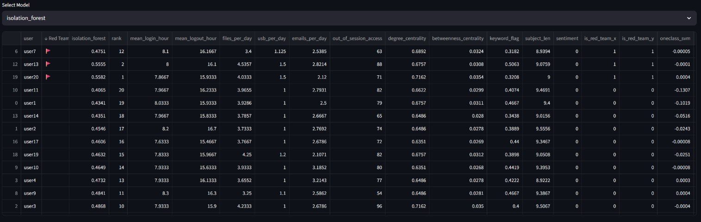
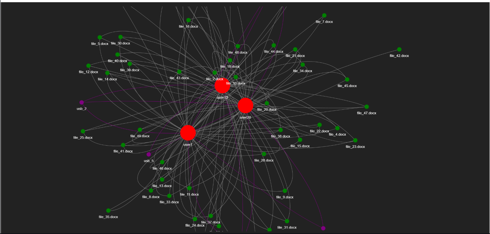

# AI-Powered Insider Anomaly Detection System


This project is an advanced, AI-powered system designed to detect insider threats by analyzing user behavior, system access, and relationships using machine learning and graph analysis techniques.

## 📸 Dashboard Screenshots





## 🚀 Features & How It Works

### 1. Data Simulation & Feature Engineering
- **Simulated Logs:** Generates synthetic logs for user logins, file access, USB usage, and emails, mimicking real organizational activity.
- **Feature Engineering:** Extracts critical features such as login/logout patterns, file/USB/email activity rates, out-of-session file access, graph centrality, and NLP features from email subjects.

### 2. Anomaly Detection Algorithms
- **Isolation Forest:** Randomly partitions data to isolate points and identify anomalies based on path lengths in trees.
- **One-Class SVM:** Finds a boundary in feature space to enclose normal data; points outside are flagged as anomalies.
- **Autoencoder:** A neural network that learns to compress and reconstruct inputs. High reconstruction error indicates an anomalous event.

### 3. Graph Analysis
- **Entity Graph:** Models users, files, and devices as nodes, with edges representing access or usage (built using `NetworkX`).
- **Centrality Measures:** Computes degree and betweenness centrality to understand user activity levels and potential information flow control.
- **At-Risk Subgraph:** Focuses on high-risk users and their direct connections for visualization.

### 4. Explainable AI (XAI)
- **SHAP & LIME:** Computes feature importances for each prediction, helping security analysts understand exactly *why* a specific user behavior was flagged.

### 5. Interactive Dashboard
- **Streamlit App:** Provides an interactive web interface for data exploration, anomaly review, and detailed user views.
- **Interactive Graphs:** Uses `PyVis` to render interactive network graphs of at-risk nodes directly within the dashboard.

### 6. Red Team Simulation
- Injects simulated malicious behaviors (e.g., after-hours access, mass downloads, suspicious USB usage) to proactively test and validate the system's detection capabilities.

## 🛠️ Installation

1. Clone this repository:

```bash
git clone <repository-url>
cd AI-Powered-Insider-Anomaly-Detection-System
````

2. Install the required dependencies:

```bash
pip install -r requirements.txt
```

## 💻 Usage

To run the full combined interactive Streamlit dashboard, execute the following command from the root project directory:

```bash
streamlit run dashboard/combined_dashboard.py
```

Alternatively, to run the simplified anomaly score dashboard:

```bash
streamlit run dashboard/app.py
```

## 📂 Project Structure

```text
AI-Powered-Insider-Anomaly-Detection-System/
│
├── dashboard/          # Streamlit application code and graph visualizers
├── data/               # Simulated logs, extracted features, anomaly scores
├── explainability/     # SHAP and LIME explainability scripts
├── features/           # Feature engineering and preprocessing logic
├── models/             # Isolation Forest, One-Class SVM, Autoencoder models
├── gnn/                # Graph Neural Network components
├── lib/                # Core utility libraries
├── img/                # Screenshots and documentation assets
│
├── requirements.txt
├── README.md
└── ...
```

### Directory Overview

* **dashboard/** – Contains the Streamlit dashboards, interactive visualizations, and graph exploration tools.
* **data/** – Stores generated logs, engineered features, anomaly scores, and intermediate datasets.
* **explainability/** – Implements SHAP and LIME for interpretable anomaly detection.
* **features/** – Handles preprocessing, feature extraction, and behavioral analytics.
* **models/** – Includes Isolation Forest, One-Class SVM, and Autoencoder-based anomaly detection models.
* **gnn/** & **lib/** – Graph generation, graph analytics, utility functions, and supporting libraries.
* **img/** – Dashboard screenshots, diagrams, and documentation images.

## 🧠 Technologies Used

* Python
* Streamlit
* Pandas
* NumPy
* Scikit-learn
* TensorFlow / Keras
* NetworkX
* PyVis
* SHAP
* LIME
* Matplotlib
* Jupyter Notebook

## 🎯 Use Cases

* Insider Threat Detection
* User Behavior Analytics (UBA)
* Security Operations Center (SOC) Monitoring
* Risk-Based Access Monitoring
* Organizational Security Research
* Cybersecurity Education and Demonstration

## 📜 License

This project is intended for educational and research purposes.

```
```
